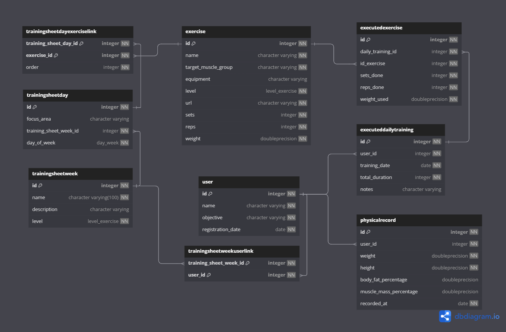

# 🚀 MuscleFlow API

Este repositório contém uma API desenvolvida para gerenciar uma **plataforma de treinos físicos**, construída com **Python, FastAPI e SQLModel**, integrando diversos conceitos fundamentais de boas práticas em desenvolvimento de software.

---

### 🛠️ Tecnologias e Princípios Aplicados

* 🧑‍💻 **Python e FastAPI:** Desenvolvimento de APIs RESTful de alta performance.
* 🗂️ **PostgreSQL:** Banco de dados relacional para persistência de dados.
* 🔄 **SQLModel:** Mapeamento objeto-relacional (ORM) que combina o melhor de SQLAlchemy e Pydantic.
* 📦 **DTO (Data Transfer Object):** Transferência eficiente e segura de dados entre as camadas da aplicação.
* 🔍 **Filtragem e Paginação:** Para otimizar requisições de grandes volumes de dados, como na listagem de usuários e exercícios.
* 📖 **Swagger/OpenAPI:** Documentação interativa para explorar os endpoints da API.

---

### ✨ Funcionalidades Principais

* **👤 Gestão de Usuários:**
    * Criação, leitura (por ID e geral), atualização e exclusão.
    * Filtragem por critérios específicos e visualização de dados físicos (`PhysicalRecord`).
* **🏋️ Gestão de Exercícios:**
    * Criação, leitura e manutenção de um catálogo detalhado de exercícios.
    * Inclui informações como nome, grupo muscular alvo, equipamento, nível e padrão de séries/repetições/peso.
    * Consulta para identificar os exercícios mais executados.
* **📋 Gestão de Fichas de Treino (Training Sheets):**
    * Criação de fichas de treino semanais (`TrainingSheetWeek`) com nome, descrição e nível.
    * Definição de dias de treino (`TrainingSheetDay`) com áreas de foco e associação a exercícios específicos.
    * Associação de fichas de treino a usuários (`TrainingSheetUserLink`).
* **📊 Registro de Treinos Executados:**
    * Registro de treinos diários concluídos (`ExecutedDailyTraining`) por usuários.
    * Registro detalhado de exercícios executados (`ExecutedExercise`), incluindo séries, repetições e peso utilizado.
* **📈 Monitoramento de Progresso Físico:**
    * Registro e consulta de dados físicos do usuário (`PhysicalRecord`), como peso, altura, percentual de gordura corporal, para acompanhamento da evolução.

---
### 💾 Diagrama do database



---

### 📂 Estrutura do Projeto

```
MuscleFlowAPI/
├── 📂 dtos/                   # Data Transfer Objects (DTOs) para requisições e respostas.
│   ├── 📂 user/
│   ├── 📂 exercise/
│   └── ...
├── 📂 models/                 # Definições dos modelos de dados (SQLModel) que mapeiam as tabelas do banco.
├── 📂 routers/                # Endpoints da API (FastAPI) para diferentes entidades.
├── 📂 db/                     # Configuração do banco de dados e gerenciamento de sessão.
├── 📄 main.py                 # Ponto de entrada da aplicação FastAPI.
```

---

### 🚀 Como Rodar o Projeto Localmente

1.  **Clone o repositório:**
    ```bash
    git clone https://github.com/SeuUsuario/MuscleFlowAPI.git
    ```
2.  **Navegue até a pasta do projeto:**
    ```bash
    cd MuscleFlowAPI
    ```
3.  **Crie e ative um ambiente virtual (recomendado):**
    ```bash
    python -m venv venv
    # No Windows
    .\venv\Scripts\activate
    # No macOS/Linux
    source venv/bin/activate
    ```
4.  **Instale as dependências:**
    ```bash
    pip install -r requirements.txt
    ```
5.  **Configure a string de conexão do PostgreSQL:**
    * Edite o arquivo de configuração (ex: `config.py` ou diretamente em `db/database.py`, dependendo da sua implementação) para apontar para o seu banco de dados PostgreSQL.
6.  **Execute as migrações do banco de dados (se você usar Alembic com SQLModel):**
    * Este passo pode variar. Se você está criando as tabelas diretamente na inicialização do SQLModel, pode não ser necessário.
    * Exemplo (se tiver um script de migração): `alembic upgrade head`
7.  **Execute o projeto:**
    ```bash
    uvicorn main:app --reload
    ```
8.  **Acesse a documentação interativa:**
    * Abra seu navegador e vá para `http://127.0.0.1:8000/docs` para explorar os endpoints via Swagger UI.